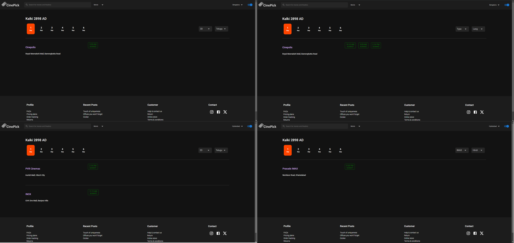
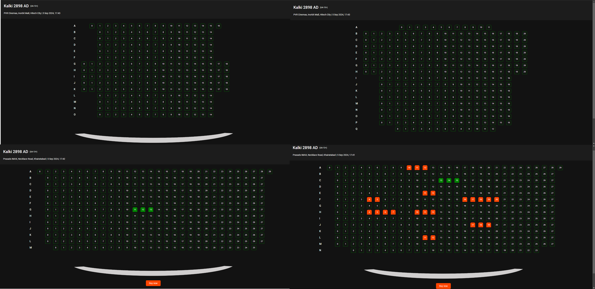

---

# 🎬 CinePick Movies Website

**A Java Full Stack Movies Website with Microservices Architecture**

## 💻 Tech Stack

- **Backend**: ![spring] ![fastapi] ![rabbitmq] ![postgres]
- **Frontend**: ![React.js]
- **Recommendation Engine**: ![langchain]

## 🚀 Overview

CinePick is a modern, full-featured movies website built using **Spring Boot**, **FastAPI**, **React.js** and **Langchain**. It provides a smooth user experience with dynamic content tailored to the user’s location and preferences. From searching and filtering movies to booking seats and getting personalized movie recommendations, CinePick offers it all!

## ✨ Key Features

- **Microservice Architecture** using **Spring Boot** and **FastAPI** for high scalability and separation of concerns.
- **Responsive UI** built with **React.js** for a seamless experience on medium to large screens.
- **Dynamic Movie Shows** filtered by city, date, show type (2D, 3D, IMAX), and language.
- **Interactive Seat Booking System** with real-time availability and seat selection.
- **Personalized Movie Recommendations** powered by user browsing history.
- **Instant Theme Switching** between Dark and Light modes.
  
## 🛠️ Microservice Architecture

CinePick is structured using a microservice architecture to ensure flexibility and scalability:

- **MovieApp Microservice**: Handles authentication, basic CRUD operations (movies, theatres, shows, users, screens), and communicates with other microservices via RabbitMQ and REST APIs.
  
- **Booking Microservice**: Manages booking requests from the **booking_queue**, checking seat availability, and confirming or rejecting bookings accordingly.

- **History Microservice**: Tracks users' browsing activities, such as visited movie pages, and sends this data to the Recommender Microservice.

- **Recommendation Microservice**: A **FastAPI** microservice that uses browsing history to provide personalized movie suggestions.

RabbitMQ is utilized to prevent race conditions, ensuring that multiple users cannot book the same seat at the same time.

## 🎟️ Dynamic Shows & Theatre Screens

- **Dynamic Shows**: Movie shows are updated dynamically based on user location, selected date, show type, and language. Advance booking is available for upcoming shows.

  
- **Theatre Screens**: Seat layouts vary between different theatres and screens, and users can book seats for multiple showtimes and dates. Booked seats are shown in red, and selected seats in green.

## 🔮 Browsing History-Based Recommendations

CinePick tracks user behavior to offer movie recommendations based on:

- Recently visited movie pages.
- Movies reviewed by the user.
- Movies the user purchased tickets for.

These recommendations adapt to the user's actions during each session, ensuring a fresh experience every time they log in.

## 🎨 Instant Theme Switching

Users can toggle between **Dark Mode** and **Light Mode** at any time, enhancing the viewing experience according to their preference.

[HTML]: https://img.shields.io/badge/HTML-grey?style=for-the-badge&logo=html5
[CSS]: https://img.shields.io/badge/CSS-blue?style=for-the-badge&logo=css3
[React.js]: https://img.shields.io/badge/React-20232A?style=for-the-badge&logo=react&logoColor=61DAFB
[spring]: https://img.shields.io/badge/Spring--Boot-249141?style=for-the-badge&logo=spring&logoColor=white
[rabbitmq]: https://img.shields.io/badge/RabbitMQ-orange?style=for-the-badge&logo=rabbitmq&logoColor=white
[postgres]: https://img.shields.io/badge/PostgreSQL-blue?style=for-the-badge&logo=postgresql&logoColor=white
[langchain]: https://img.shields.io/badge/Langchain-black?style=for-the-badge&logo=langchain
[fastapi]: https://img.shields.io/badge/FastAPIt-blue?style=for-the-badge&logo=fastapi&logoColor=white